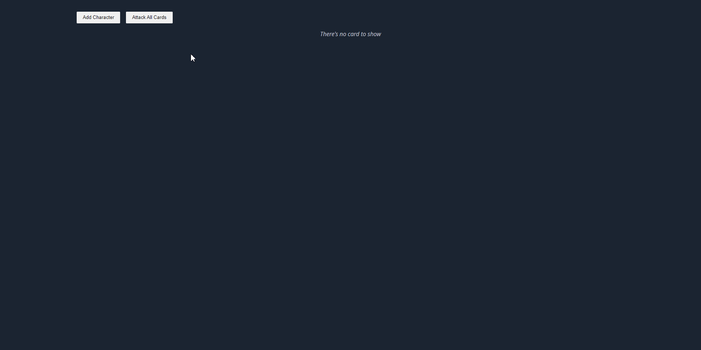
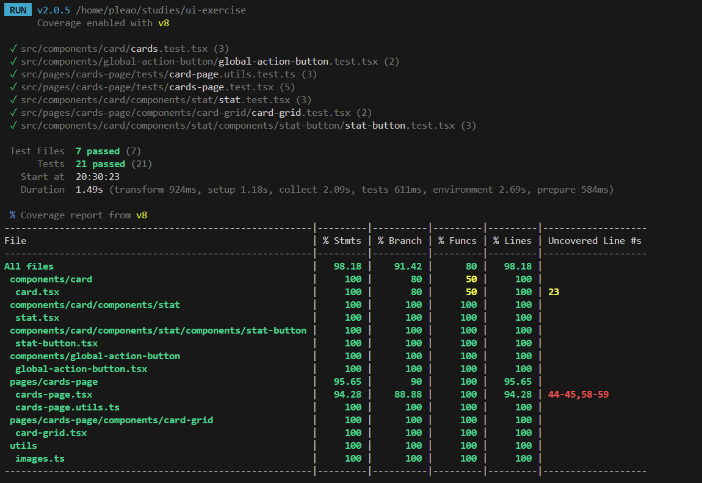

# UI Exercise

This project is a TypeScript-based React application designed to implement various components and features using modern frontend technologies.



## Key Technologies and Libraries Used

- **React**: For building the user interface.
- **TypeScript**: For type safety and enhanced development experience.
- **Vite**: As the build tool and development server for fast setup and hot module replacement.
- **Vitest**: For unit testing components.
- **React Testing Library**: For testing React components in a user-centric way.
- **Storybook**: For developing and showcasing UI components in isolation.
- **SCSS**: For styling components.

## Project Structure

The project is organized into several directories to maintain a clean and scalable architecture. Below is a brief overview of the main folders and files:

```
src
├── components
│   ├── component
│       ├── component.constants.ts
│       ├── component.mocks.ts
│       ├── component.stories.tsx
│       ├── component.styles.scss
│       ├── component.tsx
│       ├── component.types.ts
│       ├── component.test.tsx
│       ├── components
│       └── index.ts
├── pages
│   └── cards-page
├── utils
├── App.tsx
├── index.css
├── main.tsx
```

### Components

- **Card Component** (`components/card`): This directory contains all files related to the Card component, including the main implementation (`card.tsx`), styling (`card.styles.scss`), types (`card.types.ts`), constants (`card.constants.ts`), mocks (`card.mocks.ts`), tests (`cards.test.tsx`), and Storybook stories (`card.stories.tsx`).

- **Global Action Button Component** (`components/global-action-button`): Similar structure to `card` with its own files for mocks, stories, styles, tests, and main implementation.

### Pages

- **Cards Page** (`pages/cards-page`): Contains the implementation of a specific page that likely utilizes the card components.

### Utilities

- **Utils Directory** (`utils`): A place for utility functions and helper files that can be reused across the project.

### Main Files

- **App.tsx**: The main application component.
- **index.css**: The global CSS file.
- **main.tsx**: The entry point for the React application.

## Getting Started

### Prerequisites

Ensure you have the following installed:

- **Node.js**: Version 20 or higher.
- **npm**: Version 10.5 or higher.

### Installation

To install the project dependencies, run:

```bash
npm i
```

### Running the Project

To start the development server, use:

```bash
npm run dev
```

This command will start Vite, and the project will be accessible in your browser.

### Running Tests

To run all tests in the project, use:

```bash
npm run test
```

### Storybook

To view the Storybook for this project, run:

```bash
npm run storybook
```

This will open a new tab in your browser with Storybook running locally.

## Project Architecture

The architecture of this project follows best practices for scalability and maintainability, using components structured in a way that promotes reuse and modularity.

- **SOLID Principles**: Components are designed following SOLID principles to ensure they are single-responsibility and easy to extend or modify.
- **Feature Design**: Common components that are used across multiple features are kept in the main components folder to ensure reusability and maintainability. Components that are specific to a particular feature are placed in subfolders within the main components folder or close to the feature they are associated with. If a component is not intended for reuse, it is stored near where it is used to maintain a clear and organized structure, making the codebase easier to navigate and understand.

## Component Development

Each component is designed with the following file structure to ensure consistency and ease of use:

```
ComponentName
├── ComponentName.tsx # Main component file
├── ComponentName.styles.scss # Styling for the component
├── ComponentName.types.ts # TypeScript types for the component only if necessary
├── ComponentName.stories.tsx # Storybook stories for the component
├── ComponentName.test.tsx # Unit tests for the component
├── ComponentName.mocks.ts # Mocks for testing
├── components # Subcomponents if any
└── index.ts # Entry point for exports
```

## Testing

The project uses Vitest and React Testing Library for testing. Tests are written for all components to ensure functionality and reliability, achieving more than 90% test coverage.



## Pitfalls and Considerations

This project uses React Strict Mode, which helps identify potential issues by running components and hooks twice in development. As a result, you may notice that state updates (like counters) increase or decrease by two instead of one. This double execution is intentional for detecting side effects and won’t occur in production. Remember, this behavior is normal during development and is designed to improve code quality and performance.

## Future Enhancements

The architecture and setup of this project are designed to easily accommodate new features and pages, adhering to scalable software development practices.
