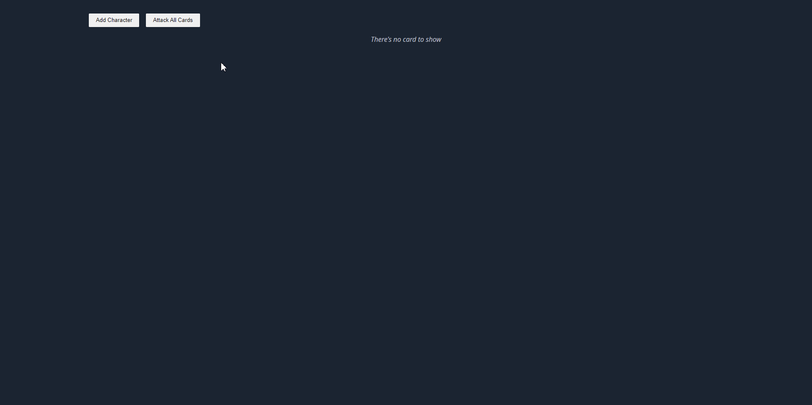
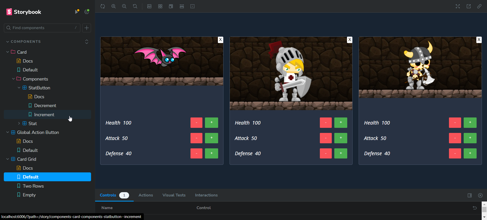
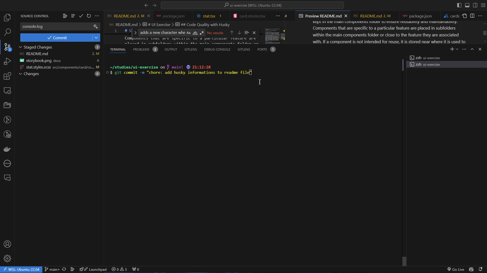
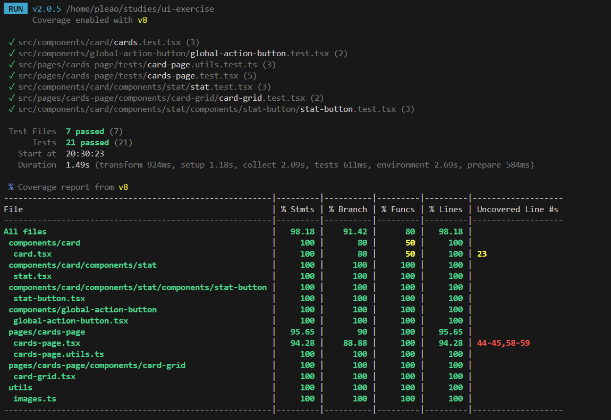

# UI Exercise

This project is a TypeScript-based React application designed to implement various components and features using modern frontend technologies.

This solution replicates a provided mockup using React, focusing on creating a responsive application with specific styles and behaviors. Each card includes randomized header images and controls for adjusting health, attack, and defense stats. The application allows adding new characters with randomized images and resetting all characters' health with global actions. The design is responsive, ensuring cards adapt to different screen sizes, and includes bonus features like character removal and hover effects for an enhanced user experience.



## Key Technologies and Libraries Used

- **React**: For building the user interface.
- **TypeScript**: For type safety and enhanced development experience.
- **Vite**: As the build tool and development server for fast setup and hot module replacement.
- **Vitest**: For unit testing components.
- **React Testing Library**: For testing React components in a user-centric way.
- **Storybook**: For developing and showcasing UI components in isolation.
- **SCSS**: For styling components.

## Getting Started

### Prerequisites

Ensure you have the following installed:

- **Node.js**: Version 20 or higher.
- **npm**: Version 10.5 or higher.

### Installation

To install the project dependencies, run:

```bash
npm i
```

### Running the Project

To start the development server, use:

```bash
npm run dev
```

This command will start Vite, and the project will be accessible in your browser.

### Running Tests

To run all tests in the project, use:

```bash
npm run test
```

### Storybook

To view the Storybook for this project, run:

```bash
npm run storybook
```

This will open a new tab in your browser with Storybook running locally.



## Project Structure

The project is organized into several directories to maintain a clean and scalable architecture. Below is a brief overview of the main folders and files:

```
src
├── components
│   ├── card
│   ├── global-action-button
├── pages
│   └── cards-page
├── utils
├── App.tsx
├── index.css
├── main.tsx
```

## Project Architecture

The architecture of this project follows best practices for scalability and maintainability, using components structured in a way that promotes reuse and modularity.

- **SOLID Principles**: Components are designed following SOLID principles to ensure they are single-responsibility and easy to extend or modify.
- **Feature Design**: Common components that are used across multiple features are kept in the main components folder to ensure reusability and maintainability. Components that are specific to a particular feature are placed in subfolders within the main components folder or close to the feature they are associated with. If a component is not intended for reuse, it is stored near where it is used to maintain a clear and organized structure, making the codebase easier to navigate and understand.

## Code Quality with Husky

Husky has been implemented in this project to ensure code quality and maintain best practices. It enforces a commit linter, automatically checks and fixes code formatting using Prettier, and runs ESLint to catch potential issues. Additionally, all tests are run before each commit to ensure that no changes break the main codebase. This setup helps maintain a clean and stable codebase, preventing errors from reaching production.



## Component Development

Everything was created with minimal third-party libraries to demonstrate a deep understanding of React, HTML, and CSS/SASS. All styles were developed from scratch, avoiding any CSS frameworks like Bootstrap or Tailwind, and component libraries like Chakra UI. This approach was chosen to showcase proficiency in building custom solutions using React.

Each component is designed with the following file structure to ensure consistency and ease of use:

```
ComponentName
├── ComponentName.tsx # Main component file
├── ComponentName.styles.scss # Styling for the component
├── ComponentName.types.ts # TypeScript types for the component only if necessary
├── ComponentName.stories.tsx # Storybook stories for the component
├── ComponentName.test.tsx # Unit tests for the component
├── ComponentName.mocks.ts # Mocks for testing
├── components # Subcomponents if any
└── index.ts # Entry point for exports
```

## Styling Approach

This project uses SCSS for styling, following the BEM (Block Element Modifier) methodology to maintain a consistent and scalable codebase. The use of SCSS allows for nested styles and modularization, making it easier to manage complex stylesheets. Almost all measurements are defined in rem units to ensure responsiveness and scalability, except for smaller measurements like borders in general, which use px for precision. This approach helps create a clean, maintainable, and flexible styling architecture.

## Testing

The project uses Vitest and React Testing Library for testing. Tests are written for all components to ensure functionality and reliability, achieving more than 90% test coverage.



## Pitfalls and Considerations

This project uses **React Strict Mode**, which helps identify potential issues by running components and hooks twice in development. As a result, you may notice that state updates (like stats) increase or decrease by two instead of one. This double execution is intentional for detecting side effects and won’t occur in production. Remember, this behavior is normal during development and is designed to improve code quality and performance.

## Future Enhancements

The architecture and setup of this project are designed to easily accommodate new features and pages, adhering to scalable software development practices.

Possible future improvments:

- Add a Fallback Image: Implement a fallback image for character cards in case the main image fails to load, ensuring a consistent user experience.

- Define Maximum and Minimum Stat Values: Set upper and lower limits for each stat (health, attack, defense) to prevent unrealistic values and enhance game logic.

- Ensure Consistent Image Sizes: Standardize the size of all images to maintain a uniform appearance across character cards, regardless of the source image dimensions.

- Use a third party library to improve the icons
